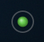

# Internet Status

A lightweight macOS menu bar app that continuously monitors your internet connection quality and displays it as a colored sphere.



## Why?

Sometimes you need a quick, always-visible indicator of how your internet is doing — no dashboards, no terminal windows, just a glance at the menu bar:

- **On a plane** with spotty Wi-Fi — know instantly when the connection drops or degrades
- **Working from a cafe or hotel** — catch connectivity issues before your video call does
- **Debugging network problems** — see packet loss and latency trends at a glance without running a terminal ping
- **Tethering from your phone** — monitor whether your mobile connection is holding up

## Download & Install

1. Download **[InternetStatus-1.0.1.zip](https://github.com/jurney/internet-status/releases/latest/download/InternetStatus-1.0.1.zip)**
2. Unzip it (double-click the .zip file)
3. Drag **Internet Status.app** to your **Applications** folder
4. Double-click to launch — if macOS says the app is from an "unidentified developer":
   - Open **System Settings > Privacy & Security**
   - Scroll down and click **Open Anyway** next to the Internet Status message
   - You only need to do this once

A colored sphere will appear in your menu bar. That's it — you're running.

## How It Works

The app sends ICMP pings once per second and tracks results over a configurable sample window.

**Color** indicates packet loss:
| Color | Packet Loss |
|-------|------------|
| Green | 0% |
| Yellow | > 0 – 20% |
| Orange | > 20 – 80% |
| Red | > 80% |

**Size** indicates average latency — the sphere shrinks as latency increases (relative to a background ring at full size so the change is visible). Full size at your configured minimum ping, shrinks rapidly as latency increases.

**Hover** over the icon to see a ping summary: packet loss %, sample count, and avg/min/max latency.

## Controls

- **Left-click** the icon to pause/resume pinging (grey sphere when paused)
- **Right-click** to open the settings menu:
  - **Ping Target** — google.com, Cloudflare DNS, Google DNS, Quad9 DNS, OpenDNS
  - **Ping Range** — configures which latency range maps to icon size
  - **Sample Window** — number of packets to consider (5, 10, 30, 60, 300)
  - **Launch at Login** — enabled by default

## Building from Source

Requires Xcode command line tools (`xcode-select --install`).

```bash
make            # build universal binary (arm64 + x86_64)
make run        # build and launch
make release    # build and create distributable .zip
make clean      # remove build artifacts
```

## Technical Details

- **Language:** Swift + AppKit (no SwiftUI, no Electron, no frameworks)
- **Ping method:** Raw ICMP sockets (no subprocess spawning)
- **Binary:** Universal (Apple Silicon + Intel)
- **Memory:** ~18 MB physical footprint
- **CPU:** near zero — one ICMP packet per second
- **macOS 13+** required (uses `SMAppService` for login item management)
- Single-instance enforced — launching a second copy exits immediately
